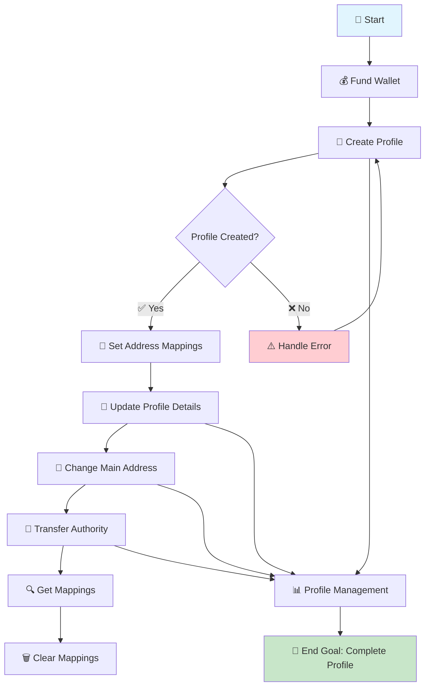
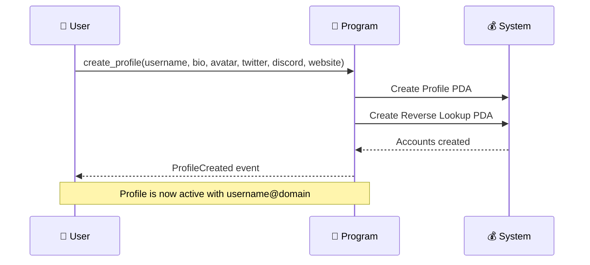
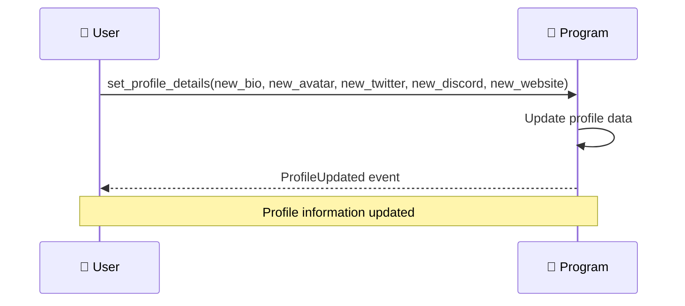
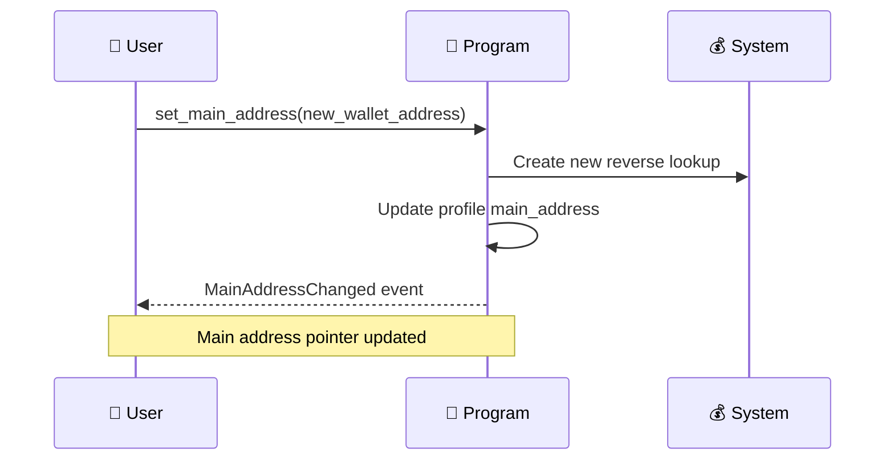
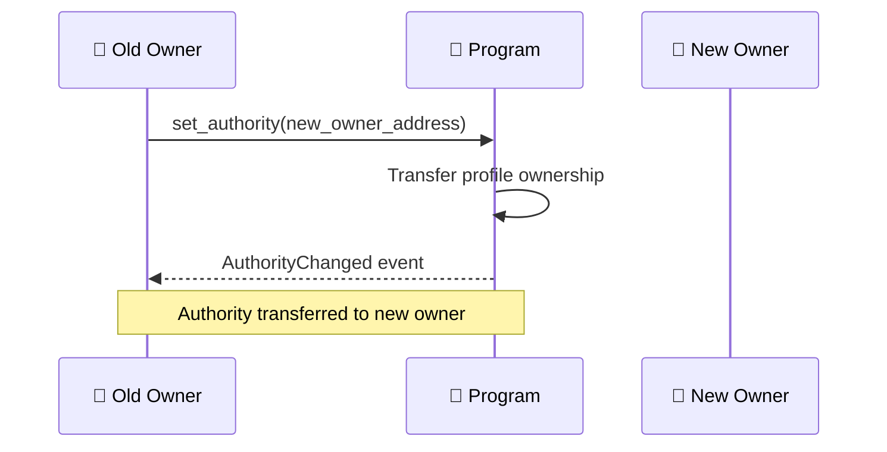
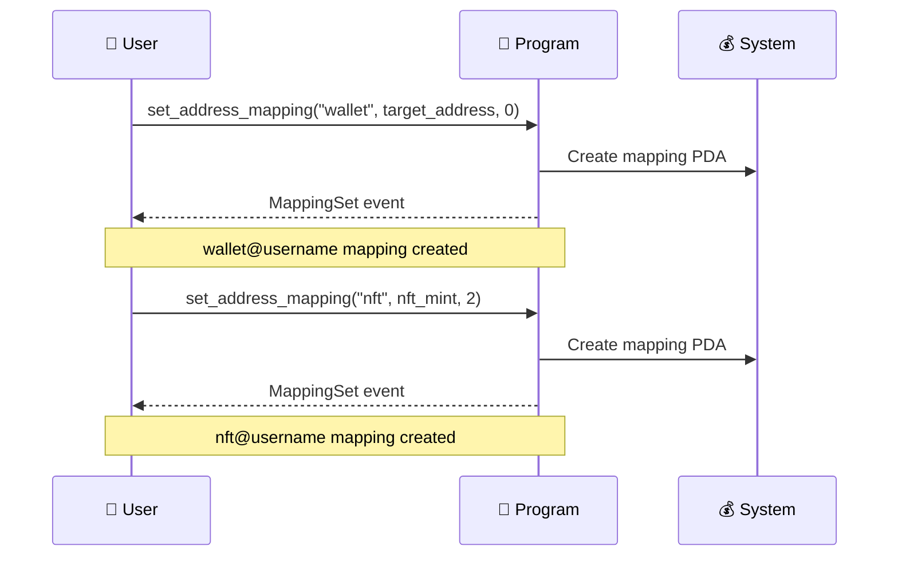
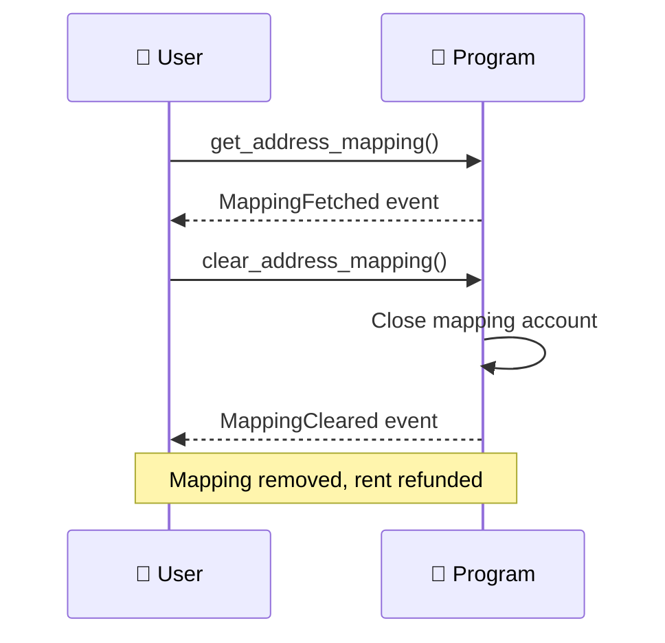
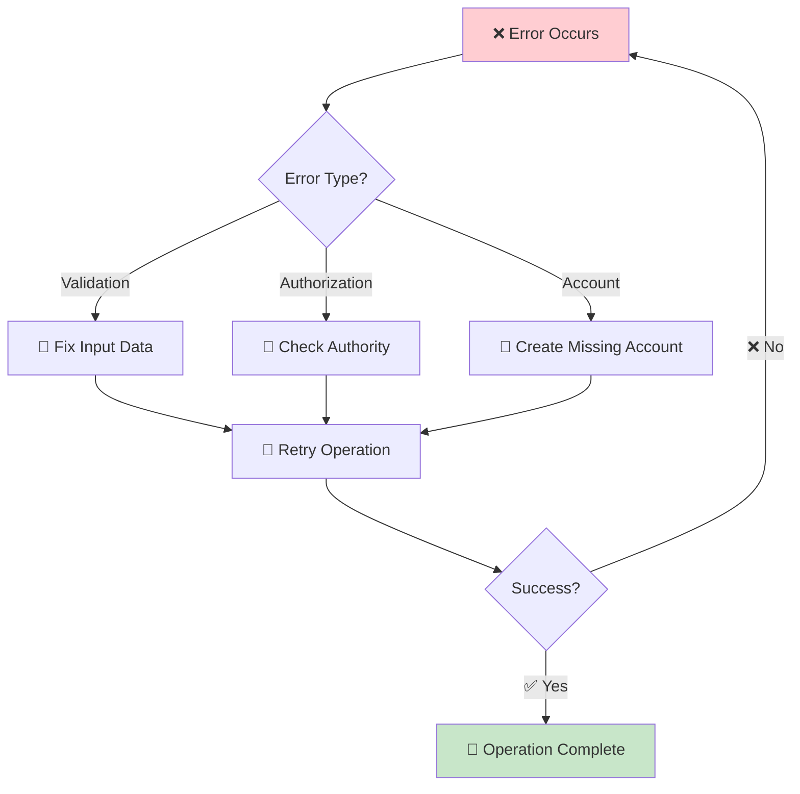
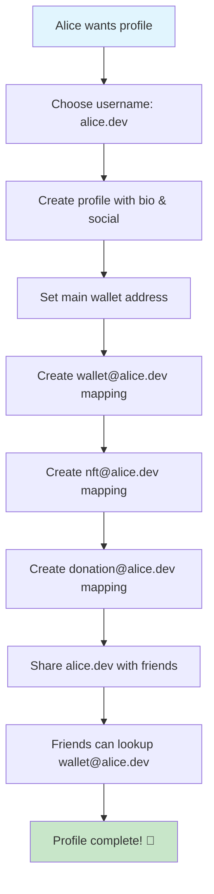

# 🚀 Solana Profile Management Contract - Complete User Flow Guide

## 📋 Table of Contents
1. [Overview](#overview)
2. [Contract Architecture](#contract-architecture)
3. [User Flow Diagram](#user-flow-diagram)
4. [Function Reference](#function-reference)
5. [Step-by-Step Workflow](#step-by-step-workflow)
6. [Error Handling](#error-handling)
7. [Best Practices](#best-practices)

---

## 🎯 Overview

This contract provides a decentralized profile management system with UPI-style address mapping capabilities. Users can create profiles, manage social links, and create mappings like `wallet@username`, `nft@username`, etc.

**Key Features:**
- ✅ Unique username profiles (lowercase, 1-32 chars, no @)
- ✅ Social media integration (Twitter, Discord, Website)
- ✅ UPI-style address mapping (`type@username`)
- ✅ Reverse lookup system
- ✅ Authority management and transfer
- ✅ Rent refund on mapping deletion

---

## 🏗️ Contract Architecture

```
┌─────────────────────────────────────────────────────────────┐
│                    Solana Blockchain                       │
├─────────────────────────────────────────────────────────────┤
│  Program ID: GrJrqEtxztquco6Zsg9WfrArYwy5BZwzJ4ce4TfcJLuJ │
├─────────────────────────────────────────────────────────────┤
│                    PDA Accounts                            │
│  ┌─────────────────┐  ┌─────────────────┐  ┌─────────────┐ │
│  │   Profile       │  │   Mapping       │  │  Reverse    │ │
│  │ ["profile",     │  │ ["mapping",     │  │ ["reverse", │ │
│  │    username]    │  │  username,      │  │   address]  │ │
│  │                 │  │  address_type]  │  │             │ │
│  └─────────────────┘  └─────────────────┘  └─────────────┘ │
└─────────────────────────────────────────────────────────────┘
```

---

## 🔄 User Flow Diagram



---

## 📚 Function Reference

### 1. 🆕 **Create Profile** - `create_profile`

**Purpose:** Initialize a new user profile with unique username

**Parameters:**
```rust
pub fn create_profile(
    ctx: Context<CreateProfile>,
    username: String,           // 1-32 chars, lowercase, no @
    bio: Option<String>,        // Max 256 chars
    avatar: Option<String>,     // Max 128 chars (URL/CID)
    twitter: Option<String>,    // Max 32 chars
    discord: Option<String>,    // Max 32 chars
    website: Option<String>,    // Max 64 chars
) -> Result<()>
```

**Returns:** `Result<()>` - Success or error

**Required Accounts:**
- `authority`: Signer (payer & initial owner)
- `profile`: PDA ["profile", username]
- `reverse`: PDA ["reverse", authority]
- `system_program`: System program

**Events Emitted:**
```rust
ProfileCreated {
    profile: Pubkey,
    authority: Pubkey,
    main_address: Pubkey,
    username: String,
}
```

---

### 2. ✏️ **Update Profile** - `set_profile_details`

**Purpose:** Modify profile information (bio, avatar, social links)

**Parameters:**
```rust
pub fn set_profile_details(
    ctx: Context<EditProfile>,
    bio: Option<String>,        // Max 256 chars
    avatar: Option<String>,     // Max 128 chars
    twitter: Option<String>,    // Max 32 chars
    discord: Option<String>,    // Max 32 chars
    website: Option<String>,    // Max 64 chars
) -> Result<()>
```

**Returns:** `Result<()>` - Success or error

**Required Accounts:**
- `authority`: Signer (profile owner)
- `profile`: Existing profile account

**Events Emitted:**
```rust
ProfileUpdated {
    profile: Pubkey,
    authority: Pubkey,
}
```

---

### 3. 🔗 **Change Main Address** - `set_main_address`

**Purpose:** Update the main wallet address pointer for the profile

**Parameters:**
```rust
pub fn set_main_address(
    ctx: Context<SetMainAddress>,
    new_main: Pubkey,          // New main wallet address
) -> Result<()>
```

**Returns:** `Result<()>` - Success or error

**Required Accounts:**
- `authority`: Signer (profile owner)
- `profile`: Existing profile account
- `reverse`: PDA ["reverse", new_main]
- `system_program`: System program

**Events Emitted:**
```rust
MainAddressChanged {
    profile: Pubkey,
    new_main: Pubkey,
}
```

---

### 4. 👑 **Transfer Authority** - `set_authority`

**Purpose:** Transfer profile ownership to another wallet

**Parameters:**
```rust
pub fn set_authority(
    ctx: Context<TransferAuthority>,
    new_authority: Pubkey,     // New profile owner
) -> Result<()>
```

**Returns:** `Result<()>` - Success or error

**Required Accounts:**
- `authority`: Signer (current profile owner)
- `profile`: Existing profile account

**Events Emitted:**
```rust
AuthorityChanged {
    profile: Pubkey,
    new_authority: Pubkey,
}
```

---

### 5. 🗺️ **Create Address Mapping** - `set_address_mapping`

**Purpose:** Create UPI-style mappings like `wallet@username`, `nft@username`

**Parameters:**
```rust
pub fn set_address_mapping(
    ctx: Context<SetMapping>,
    address_type: String,       // 1-16 chars, lowercase, [a-z0-9.-]
    target: Pubkey,            // Target wallet/mint/metadata address
    type_hint: u8,             // Client tag (0=wallet, 1=token, 2=nft, 3=metadata, 4=custom)
) -> Result<()>
```

**Returns:** `Result<()>` - Success or error

**Required Accounts:**
- `authority`: Signer (profile owner)
- `profile`: Existing profile account
- `mapping`: PDA ["mapping", username, address_type]
- `system_program`: System program

**Events Emitted:**
```rust
MappingSet {
    profile: Pubkey,
    address_type: String,
    target: Pubkey,
    tag: u8,
}
```

---

### 6. 🔍 **Get Address Mapping** - `get_address_mapping`

**Purpose:** Fetch mapping data and emit event (useful for UI subscriptions)

**Parameters:**
```rust
pub fn get_address_mapping(
    ctx: Context<GetMapping>,
) -> Result<()>
```

**Returns:** `Result<()>` - Success or error

**Required Accounts:**
- `profile`: Existing profile account
- `mapping`: Existing mapping account

**Events Emitted:**
```rust
MappingFetched {
    profile: Pubkey,
    address_type: String,
    target: Pubkey,
    tag: u8,
}
```

---

### 7. 🗑️ **Clear Address Mapping** - `clear_address_mapping`

**Purpose:** Remove mapping and refund rent to authority

**Parameters:**
```rust
pub fn clear_address_mapping(
    ctx: Context<ClearMapping>,
) -> Result<()>
```

**Returns:** `Result<()>` - Success or error

**Required Accounts:**
- `authority`: Signer (profile owner)
- `profile`: Existing profile account
- `mapping`: Existing mapping account (will be closed)

**Events Emitted:**
```rust
MappingCleared {
    profile: Pubkey,
    address_type: String,
}
```

---

## 🚶‍♂️ Step-by-Step Workflow

### **Phase 1: Profile Setup** 🆕



**Steps:**
1. **Prepare Data:** Choose unique username (1-32 chars, lowercase, no @)
2. **Optional Fields:** Add bio, avatar URL, social media handles
3. **Execute:** Call `create_profile` with required parameters
4. **Verify:** Check for `ProfileCreated` event
5. **Result:** Profile PDA created at `["profile", username]`

---

### **Phase 2: Profile Customization** ✏️



**Steps:**
1. **Choose Updates:** Select which fields to modify
2. **Execute:** Call `set_profile_details` with new values
3. **Verify:** Check for `ProfileUpdated` event
4. **Result:** Profile data updated

---

### **Phase 3: Address Management** 🔗



**Steps:**
1. **Prepare:** Generate or select new wallet address
2. **Execute:** Call `set_main_address` with new address
3. **Verify:** Check for `MainAddressChanged` event
4. **Result:** Main address updated, reverse lookup created

---

### **Phase 4: Authority Transfer** 👑



**Steps:**
1. **Prepare:** Ensure new owner wallet is ready
2. **Execute:** Call `set_authority` with new owner address
3. **Verify:** Check for `AuthorityChanged` event
4. **Result:** Profile ownership transferred

---

### **Phase 5: Address Mapping** 🗺️



**Steps:**
1. **Choose Type:** Select mapping type (wallet, nft, token, metadata, custom)
2. **Prepare Target:** Get target address (wallet, mint, metadata, etc.)
3. **Execute:** Call `set_address_mapping` with parameters
4. **Verify:** Check for `MappingSet` event
5. **Result:** UPI-style mapping created (`type@username`)

---

### **Phase 6: Mapping Operations** 🔍🗑️



**Steps:**
1. **Fetch:** Call `get_address_mapping` to retrieve data
2. **Clear:** Call `clear_address_mapping` to remove mapping
3. **Verify:** Check for `MappingCleared` event
4. **Result:** Mapping deleted, rent refunded to authority

---

## ⚠️ Error Handling

### **Common Error Codes:**

| **Error Code** | **Message** | **Cause** | **Solution** |
|----------------|-------------|-----------|--------------|
| `InvalidUsername` | Invalid username: only [a-z0-9._-], 1..=32, and must not contain '@' | Username validation failed | Use valid username format |
| `InvalidAddressType` | Invalid address type: only [a-z0-9.-], 1..=16 | Address type validation failed | Use valid address type format |
| `ConstraintHasOne` | A has one constraint was violated | Wrong authority | Use correct profile owner |
| `AccountNotInitialized` | The program expected this account to be already initialized | Account doesn't exist | Create account first |

### **Error Recovery Flow:**



---

## 💡 Best Practices

### **1. Username Selection** 🏷️
- **Use:** Lowercase letters, numbers, dots, underscores, hyphens
- **Avoid:** Uppercase, special characters, @ symbols
- **Length:** Keep between 1-32 characters
- **Examples:** `john.doe`, `user123`, `my-profile`

### **2. Address Mapping Strategy** 🗺️
- **Standard Types:** `wallet`, `nft`, `token`, `metadata`
- **Custom Types:** Use descriptive names like `donation`, `backup`, `treasury`
- **Type Hints:** Use consistent enum values (0=wallet, 1=token, 2=nft, 3=metadata, 4=custom)

### **3. Security Considerations** 🔒
- **Authority Management:** Only transfer authority to trusted wallets
- **Main Address:** Keep main address secure and backed up
- **Mapping Cleanup:** Regularly clear unused mappings to recover rent

### **4. Gas Optimization** ⛽
- **Batch Operations:** Group related operations when possible
- **Rent Recovery:** Clear unused mappings to get rent back
- **Efficient Updates:** Only update changed fields

---

## 🎯 Complete User Journey Example

### **Scenario: Alice Creates Her Profile**



**Alice's Actions:**
1. **Create Profile:** `create_profile("alice.dev", "Web3 Developer", "ipfs://avatar", "alice_dev", "alice#1234", "https://alice.dev")`
2. **Set Main Address:** `set_main_address(alice_wallet_pubkey)`
3. **Create Mappings:**
   - `set_address_mapping("wallet", alice_wallet_pubkey, 0)`
   - `set_address_mapping("nft", alice_nft_collection, 2)`
   - `set_address_mapping("donation", alice_donation_wallet, 4)`

**Result:** Alice now has a complete profile accessible via:
- `alice.dev` (main profile)
- `wallet@alice.dev` → Alice's wallet
- `nft@alice.dev` → Alice's NFT collection
- `donation@alice.dev` → Alice's donation wallet

---

## 🔗 Quick Reference Commands

### **Profile Management:**
```bash
# Create profile
create_profile("username", "bio", "avatar", "twitter", "discord", "website")

# Update profile
set_profile_details("new_bio", "new_avatar", "new_twitter", "new_discord", "new_website")

# Change main address
set_main_address(new_wallet_pubkey)

# Transfer authority
set_authority(new_owner_pubkey)
```

### **Address Mapping:**
```bash
# Create mapping
set_address_mapping("type", target_pubkey, type_hint)

# Get mapping
get_address_mapping()

# Clear mapping
clear_address_mapping()
```

---

## 📞 Support & Resources

- **Contract Address:** `GrJrqEtxztquco6Zsg9WfrArYwy5BZwzJ4ce4TfcJLuJ`
- **Network:** Gorbagan Chain
- **RPC Endpoint:** `https://rpc.gorbchain.xyz`
- **Documentation:** See `MANUAL_TESTING_GUIDE.md` for detailed testing

---

**🎉 Congratulations! You now have a complete understanding of your Solana Profile Management Contract user flow. Happy building! 🚀** 